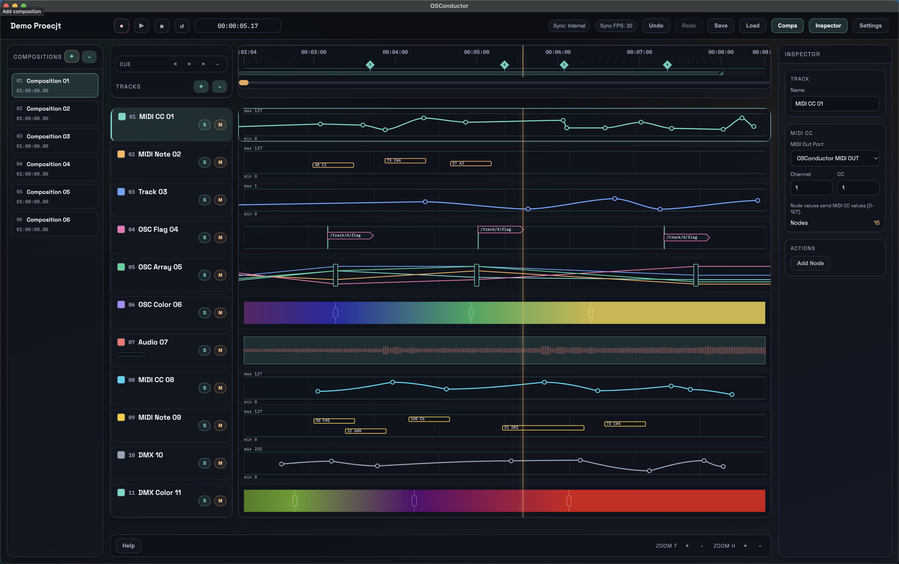

# OSConductor

<p align="left">
  
</p>

本程式全部由 AI vibe coding 產出。

OSC/Audio/MIDI/DMX 時間軸控制軟體。

## 所有功能

- 時間軸播放 / 暫停 / 定位 / Loop 範圍控制（含精準時間輸入）
- Sync 模式：Internal、MTC、LTC
- 多 Composition（可命名、切換、排序；各自記住播放軸位置）
- 軌道類型：OSC、OSC Array、OSC Flag、OSC Color、3D OSC、Audio、MIDI CC、MIDI Note、DMX、DMX Color、Group
- OSC 多輸出 Port（可命名），各 OSC 類軌道可選輸出 Port
- Audio Clip 載入、波形顯示、拖移、對齊 Cue、Audio Channel Map Patch
- MIDI CC / MIDI Note 發送（可選 Port / Channel）
- DMX / DMX Color（Art-Net）發送
- 3D OSC 節點編輯（XY/YZ + 3D 視角），以及每軌獨立 3D Monitor 視窗
- Node / Cue / Track 可複製、剪下、貼上，支援 Undo / Redo

## 目前封裝版本（v1.2.2）

位於 `release/`：

- `OSConductor-1.2.2-win-x64.exe`（Windows Intel x64）
- `OSConductor-1.2.2-win-arm64.exe`（Windows ARM64）
- `OSConductor-1.2.2-arm64.dmg`（macOS Apple Silicon，安裝檔）
- `OSConductor-1.2.2-arm64-mac.zip`（macOS Apple Silicon，壓縮版）
- `release/mac-arm64/OSConductor.app`（macOS Apple Silicon，app bundle）

## 開發

```bash
npm install
npm run dev
```

- Vite dev server 使用 `5170`
- OSC 的送出/接收/控制 port 請不要設為 `5170`

## 重新封裝

```bash
npm run build
npx electron-builder --win portable --x64 --config.win.signAndEditExecutable=false --publish never
npx electron-builder --win portable --arm64 --config.win.signAndEditExecutable=false --publish never
npx electron-builder --mac zip --arm64 --config.mac.identity=null --publish never
```

## Help（快捷鍵 / 控制）

### Keyboard

- `Space`：Play / Pause
- `C`：播放時在播放軸新增 Cue
- `,`：跳上一個 Cue
- `.`：跳下一個 Cue
- `=`：在播放軸新增 Cue
- `-`：刪除播放軸附近的 Cue
- `Backspace/Delete`：刪除選取 Node 或 Track
- `Cmd/Ctrl + O`：新增 OSC Track
- `Cmd/Ctrl + A`：新增 Audio Track
- `Cmd/Ctrl + M`：新增 MIDI CC Track
- `Cmd/Ctrl + Shift + M`：新增 MIDI Note Track
- `Cmd/Ctrl + D`：新增 DMX Track
- `Cmd/Ctrl + Shift + D`：新增 DMX Color Track
- `Cmd/Ctrl + C`：複製選取 Track 或 Node
- `Cmd/Ctrl + V`：貼上 Track，或在播放軸貼上 Node
- `Cmd/Ctrl + Z`：Undo
- `Cmd/Ctrl + Shift + Z`：Redo
- `Cmd/Ctrl + Y`：Redo（替代）
- `Cmd/Ctrl + =`：Timeline Zoom In
- `Cmd/Ctrl + -`：Timeline Zoom Out
- `Enter（Audio Channel Map）`：儲存目前 mapping 並跳下一個 Audio Track
- `↓（Audio Channel Map）`：儲存目前 mapping 並跳下一個 Audio Track
- `Top Bar: Comps`：顯示 / 隱藏 Composition 面板
- `Top Bar: Inspector`：顯示 / 隱藏 Inspector 面板
- `Esc`：關閉 Help

### Mouse

- 雙擊 Timeline：新增 Cue
- 拖拉 Cue：移動 Cue 時間
- 右鍵 Cue：編輯 / 刪除
- 雙擊 Composition：改名
- 拖拉 Composition：改順序
- `Alt/Option + 點擊 Track 的 +`：開啟 Multi Add（一次新增多軌）
- 雙擊 Node：編輯數值 / 顏色（OSC Flag 會編輯 `Time + OSC Address + OSC Value`）
- 拖拉 Node：改時間與數值
- `Alt/Option + 拖拉 Node`：吸附到最近 Cue
- 右鍵 Node：切換曲線模式
- 點擊色塊：套用 Track 顏色（可對多選軌道）
- `Shift + 點 Track`：範圍選取
- `Ctrl/Cmd + 點 Track`：間隔多選
- `Shift + Alt/Option + 滾輪`：Zoom W
- `Shift + Ctrl + 滾輪`：Zoom H

### Project / Audio Notes

- 新專案預設長度：`00:10:00.00`
- 載入 Audio Clip 時，若音檔超過目前 Project Length，會自動延長到「音檔結尾 + 30 秒」
- Audio Clip 在時間軸極小縮放時，Clip 開頭仍會與時間軸對齊
- 新增 Track 類型：`OSC Flag`（播放軸經過節點時觸發對應 OSC Address/Value）

### 3D OSC Controls

- `Inspector > Open 3D Monitor`：每一條 3D OSC 軌道可開獨立監看視窗
- `Edit 3D OSC Node`：拖曳 3D Space 旋轉視角、滾輪縮放、雙擊重置
- `3D OSC Monitor`：拖曳旋轉視角、滾輪縮放、雙擊重置
- `Edit 3D OSC Node` 與 `3D OSC Monitor` 都有 RGB XYZ 軸標示，並會跟視角同步旋轉
- 兩個 3D 視窗都採等比例顯示，不因視窗比例拉伸變形

### OSC Remote Control

先在 `Settings > OSC > OSC Control Port` 設定監聽 port。

Composition index 為 1-based（依左側 Composition 清單順序）。

- `/OSConductor/Composition/5/select`：切換到 Composition #5
- `/OSConductor/Composition/1/rec 1`：切到 #1 並開啟 REC
- `/OSConductor/Composition/1/rec 0`：切到 #1 並關閉 REC
- `/OSConductor/Composition/1/play 1`：切到 #1 並播放
- `/OSConductor/Composition/1/play 0`：切到 #1 並停止播放
- `/OSConductor/Composition/1/stop 1`：切到 #1 並停止＋定位到 `00:00:00.00`
- `/OSConductor/Composition/1/loop 1`：切到 #1 並開啟 Loop
- `/OSConductor/Composition/1/loop 0`：切到 #1 並關閉 Loop
- `/OSConductor/Composition/1/cue 10`：切到 #1 並跳到 Cue #10
- `/OSConductor/Composition/1/cue/10`：Cue 跳轉替代格式

## Brand

<p align="left">
  
</p>

- NL Interactive
- Copyright © NL Interactive

## Donate

如果這個專案對你有幫助，歡迎小額捐款支持：

<script 
  src="https://www.paypal.com/sdk/js?client-id=BAAGQjjnAX3hNGbC_Dyqs-SLAerzSUToSF9IYArL23G0EFpT7kbhJocMA67HdscBBq0h1AEJZtFiFV83do&components=hosted-buttons&disable-funding=venmo&currency=USD">
</script>

<p align="left">
  
</p>
